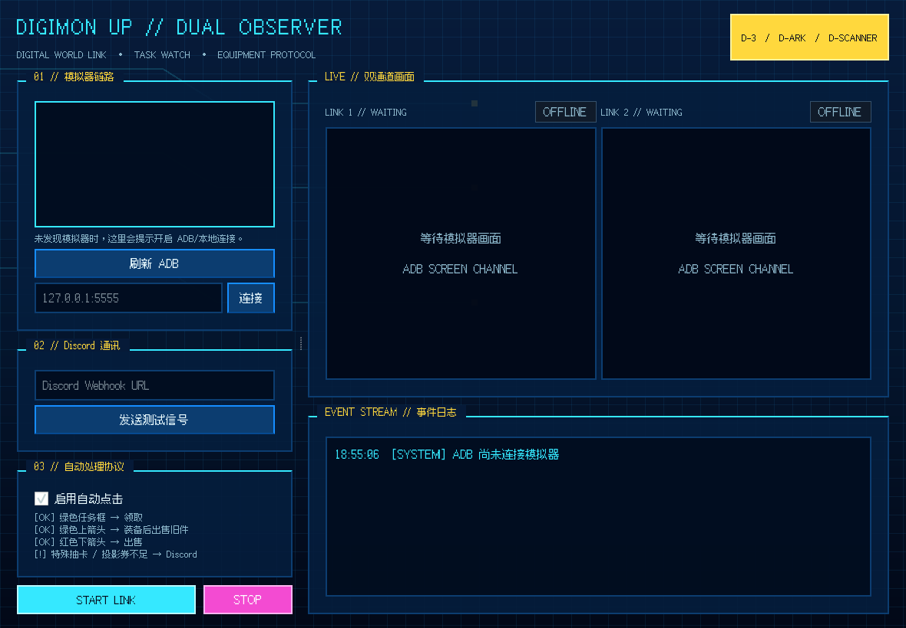

# DIGIMON UP // OBSERVER

[简体中文](README.zh-CN.md) | **繁體中文** | [English](README.md) | [日本語](README.ja.md)

一個適用於 Windows 與主流 Android 模擬器的 Digimon UP 畫面監控與安全自動化工具。程式透過 ADB 截圖並傳送點擊，不控制 Windows 滑鼠，因此模擬器可以最小化或放在其他顯示器上。預設監控一台模擬器；多模擬器模式最多支援兩台。



## 功能

- 預設選擇並監控一台安全的 ADB 模擬器，只顯示一個即時畫面。
- 開啟多模擬器模式後，可同時顯示與監控最多兩個執行個體。
- 無需系統管理員權限即可偵測 BlueStacks、雷電、夜神、MuMu、逍遙與 Genymotion 程序。
- 只有連續兩幀確認綠色任務框、目前完成數為綠色且沒有紅色目前進度時才領取任務；斜線與要求完成數可以仍為白色。白色任務框、紅色目前數值或 OCR 讀到 `1/2` 等未完成比例都會阻止點擊。
- 偵測畫面中央數碼獸右上方的白底食物氣泡，每次出現只點擊一次，並在氣泡消失後才重新待命。
- 領取後識別並關閉橫跨畫面的藍色獎勵畫面。
- 遇到技能卡或支援型數碼寶貝抽取任務時阻止自動領取，並向 Discord 傳送截圖。
- 裝備流程必須同時確認大型「出售」與「裝備」按鈕：
  - 綠色上箭頭：裝備；
  - 替換後的舊裝備變成紅色下箭頭：出售；
  - 初次彈窗就是紅色下箭頭：直接出售；
  - 箭頭不明確：按 OCR 讀到的詞條優先級比較（同時有暴擊發生率+技能暴擊發生率、只有暴擊發生率、只有技能暴擊發生率、均無）；僅當新裝備嚴格更高時裝備，否則出售；
  - 詞條 OCR 無法可靠讀取：不操作並記錄警告。
- OCR 識別全像/投影券不足後，傳送具有冷卻時間的 Discord 截圖通知。
- 可隨時關閉自動點擊，切換為只識別、不操作的觀察模式。
- UI、執行記錄、彈窗、主要錯誤與 Discord 通知支援簡體中文、繁體中文、英文與日文。

## 安裝與執行

本機已有相依套件時：

```powershell
.\run.ps1
```

也可以按兩下 `启动监控器.bat` 或 `start-monitor.bat`。

首次安裝：

```powershell
.\install.ps1
.\run.ps1
```

接著：

1. 在模擬器設定中開啟 ADB/本機偵錯。
2. 啟動模擬器與 Digimon UP。
3. 開啟監控器並按「重新整理 ADB」。
4. 將 `config.local.example.yaml` 複製為 `config.local.yaml`，填入本機 ADB 連接埠與可選的裝置別名。此檔案不會進入 Git。
5. 單一帳號維持預設單模擬器模式；雙開時啟用多模擬器模式並選擇第二台。
6. 遊戲 UI 更新後，建議先以觀察模式執行數分鐘，確認識別正常再開啟自動點擊。

程序偵測使用 Windows 原生 Tool Help 程序快照 API，只讀取執行檔名稱。它不需要系統管理員權限，也不會讀取遊戲帳號、視窗標題、程式路徑、命令列或模擬器內檔案。

- [BlueStacks ADB 官方說明](https://support.bluestacks.com/hc/en-us/articles/23925869130381-How-to-enable-Android-Debug-Bridge-on-BlueStacks-5)
- [雷電 ADB 本機連線說明](https://pre-prod-web-next.ldplayer.net/blog/introduction-to-version-4.0.37-and-3.102-features.html)
- [MuMu 官方開發說明](https://www.mumuplayer.com/help/win/developers-essentials-manual.html)

## 語言選擇

使用介面右上角的語言選擇器。切換會立即生效，並在本機 `.env` 儲存為 `DIGIMON_UI_LANGUAGE`：

- `zh_CN` — 簡體中文
- `zh_TW` — 繁體中文
- `en` — English
- `ja` — 日本語

內建 Fusion Pixel 字體會選擇對應的拉丁、簡體、繁體或日文字形；字體檔案缺少時會回退至對應的 Windows UI 字體。

## 遊戲 OCR 語言

預設 OCR 請求為 `chi_tra+chi_sim+jpn+eng`。程式會自動使用本機已安裝的 Tesseract 語言套件，並在記錄中提示缺少的語言，不會因缺少單一語言套件而使整個 OCR 失敗。

下列文字分類支援中文、英文與日文：

- 抽取技能卡片；
- 抽取支援型數碼寶貝；
- 全像/投影券不足。

若需識別日文遊戲畫面，請安裝 Tesseract 日文訓練資料 `jpn`。軟體 UI 語言與遊戲 OCR 語言互相獨立。

## Discord Webhook 與隱私

Webhook 有兩種設定方式：

1. 貼到介面的 Discord 密碼輸入框，傳送測試訊號或啟動監控。
2. 將 `.env.example` 複製為 `.env`，填入 `DIGIMON_DISCORD_WEBHOOK_URL`。

`.env`、`config.local.yaml`、`captures/` 與 `logs/` 已由 `.gitignore` 排除。請勿把真實 Webhook 寫入 `config.yaml`、原始碼、Issue、截圖或提交記錄。若曾公開，應立即在 Discord 刪除並重新產生。

## 安全邊界

- ADB 點擊使用截圖座標，不會控制 Windows 滑鼠。
- 任務領取需要綠色邊框、目前完成數為綠色且沒有紅色目前進度、OCR 有文字、連續兩幀同時成立；白色邊框、紅色目前值或未完成比例任一出現時都不點擊。
- 食物氣泡需連續兩幀確認，每次出現只觸發一次，並在連續兩幀確認消失後重新待命。
- 獎勵關閉需要藍色遮罩覆蓋畫面中段大部分寬度，裝備彈窗不會符合此條件。
- 特殊抽卡任務優先於自動領取。
- 裝備動作必須識別到成對的粉色「出售」與藍色「裝備」按鈕。
- 沒有綠色/紅色箭頭時，詞條回退邏輯僅裝備優先級嚴格更高的新裝備；同級或更低則出售，OCR 不可靠時始終不操作。
- 裝備面板無法可靠讀取或動作按鈕不成對時，始終不操作。
- 兩次動作預設至少間隔 2.5 秒；Discord 也有去重與冷卻。

閾值與時間設定位於 [config.yaml](config.yaml)。遊戲 UI、語言或長寬比大幅變更後，應回到觀察模式重新校準。

## 驗證

```powershell
python -m pytest
python tools\analyze_samples.py "截圖所在目錄"
```

## UI 與字體

介面採用深藍數碼世界底色、青色電路網格、D-3 狀態色、D-Ark 卡片邊框與 D-Scanner 紅藍警示區域，沒有複製動畫 Logo、角色圖或遊戲貼圖。

專案依據 SIL Open Font License 1.1 打包 **Fusion Pixel 12px Proportional** 四種語言字形，上游授權說明位於 `assets/fonts/`。

- [Fusion Pixel Font 與授權](https://github.com/TakWolf/fusion-pixel-font)
- [Bandai D-Scanner 視覺參考](https://www.bandai.co.jp/catalog/item.php?jan_cd=4543112120243000)
- [Bandai D-Scanner 配色參考](https://www.atpress.ne.jp/news/328455)

## 專案結構

```text
digimon_monitor/
  i18n.py                四語言翻譯與語言選擇
  adb.py                 ADB 裝置、截圖與點擊
  vision.py              任務、獎勵與裝備視覺識別
  ocr.py                 多語言 OCR 與已安裝語言套件回退
  equipment.py           多語言裝備詞條優先級與安全決策
  monitor.py             穩定幀、冷卻、通知與自動處理
  discord_notifier.py    私密 Discord Webhook 與截圖附件
  ui.py / theme.py       PySide6 像素風 UI 與本地化字體
tools/analyze_samples.py 參考截圖回歸工具
tests/                   視覺、語言、設定與裝置選擇測試
```
